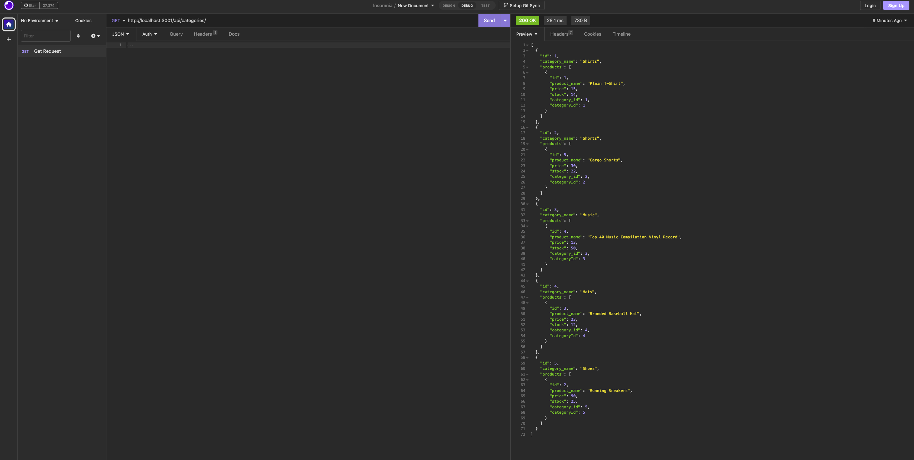

# e-Commerce-BackEnd

## Technologies Used
- [Technologies Used](#technologies-used)
- [Description](#description)
- [Installation](#installation)
- [Usage](#usage)

## Description
This application is designed to help store, retrive, delete, and update data into a database using api requests. It uses a variety of routes in order to get functionality.

## Installation
Users must have Node, Express, Sequelize, and Mysql in order to run this application. By cloning the code into your local machine and by utilizing your own personal .env file, you can start the application.

## Usage
Before starting the code, you must make sure that all dependencies are installed. Then by going into your termal and using the command "node server.js", you will be able to run your local server. Then in Insomnia you can make a series of Get,Post,Put, and Delete requests to the database.

